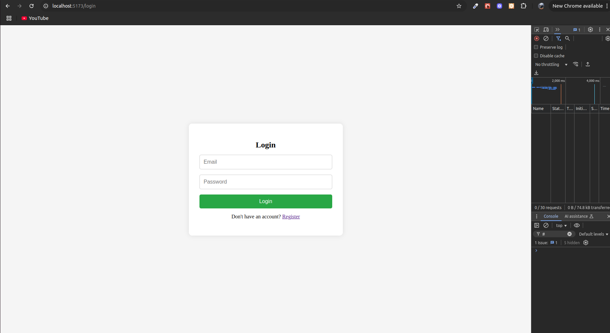
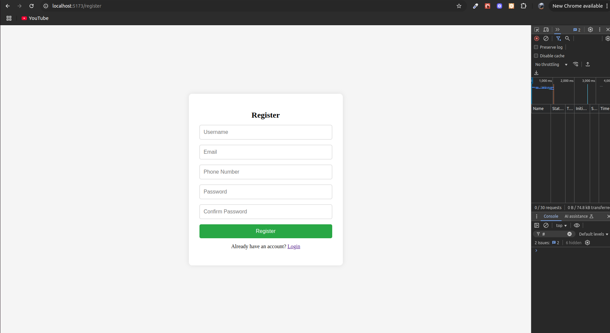
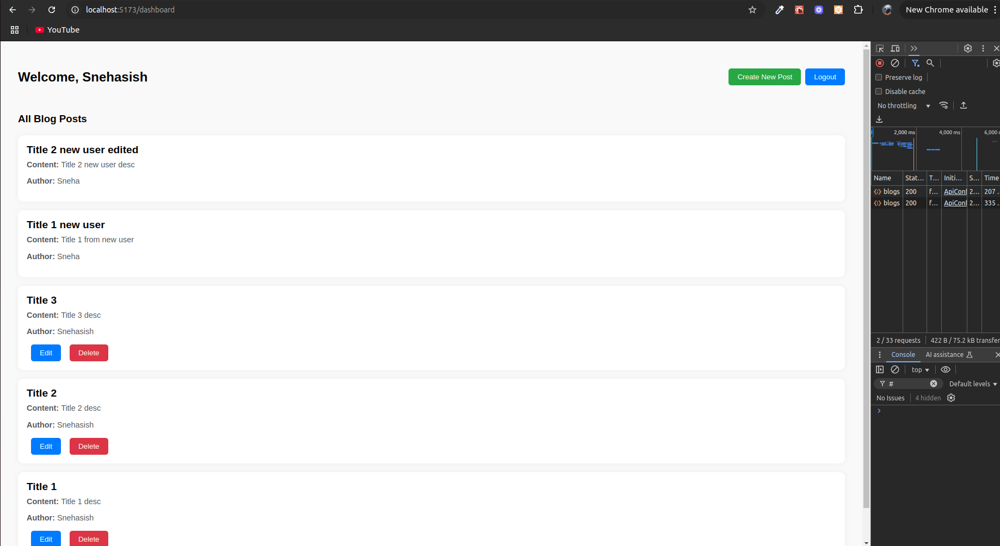
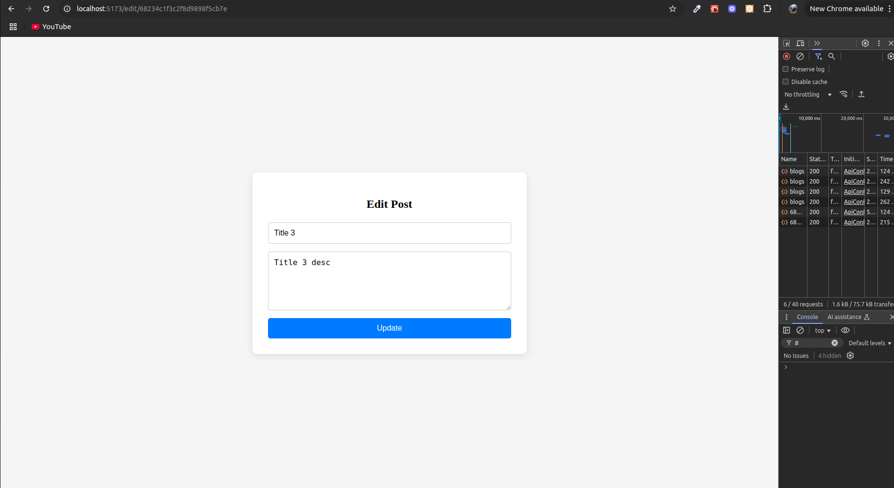
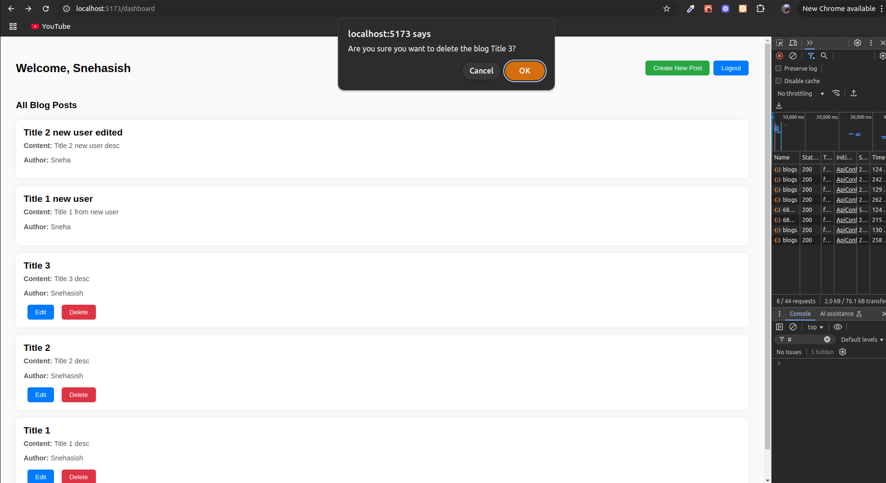

# MERN Stack Blog App

## Deployment Instructions

### Prerequisites
- Node.js and npm
- MongoDB
- PM2
- Serve

<!-- npm install -g pm2 serve -->

### 1. Backend Setup
```bash
cd backend
npm install
nodemon index.js

pm2 start index.js
```

### .env file in backend folder
MONGO_URI=mongodb-secret-key
JWT_SECRET=jwt-secret
PORT=8000
DB_NAME=blogsapp
SESSION_SECRET=session-secret

### 2. Frontend Setup
```bash
cd frontend
npm install || yarn
npm run dev || yarn dev
npm run build || yarn build

serve -s dist -l 5173
```

### .env file in frontend folder
VITE_API_URL=http://localhost:8000/api


## Screenshots






